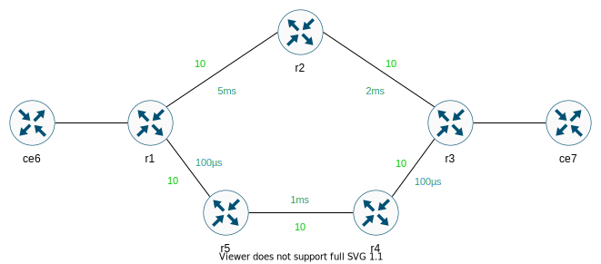

#  Cisco SRv6 L3 VPN with Flexible Algorithm and TI-LFA

This lab is heavily derivated from the [lab of the same name in Cisco
dCloud][1]. The main differences are:

- using RFC5737 for IP addresses used by CE devices
- Linux is used as a CE device (less memory)
- use LLA for interface between P and PE routers

[1]: https://dcloud-cms.cisco.com/demo_news/cisco-srv6-l3-vpn-with-flexible-algorithm-and-ti-lfa-v1



From ce6, you should be able to `ping 192.0.2.7`.

Useful commands:

```
show route ipv6
show segment-routing srv6 locator
show segment-routing srv6 sid all
show cef ipv6 2001:0:0:1:1::
show isis database verbose r1
show bgp vrf 1
show route vrf 1 ipv4
show cef vrf 1 192.0.2.7/32
```

## TI-LFA

`r4` has built a backup path to reach `r3` (when using flex algo 128):

```
RP/0/RP0/CPU0:r4#show route ipv6 2001:0:8:3::/64 detail
Tue Dec 14 18:37:22.335 UTC

Routing entry for 2001:0:8:3::/64
  Known via "isis 1", distance 115, metric 100, SRv6-locator (algo 128), type level-2
  Installed Dec 14 18:16:13.890 for 00:21:08
  Routing Descriptor Blocks
    fe80::5254:33ff:fe00:d, from 2001::3, via GigabitEthernet0/0/0/0, Protected
      Route metric is 100
      Label: None
      Tunnel ID: None
      Binding Label: None
      Extended communities count: 0
      Path id:1       Path ref count:0
      NHID:0x20001(Ref:14)
      Backup path id:65
    fe80::5254:33ff:fe00:15, from 2001::3, via GigabitEthernet0/0/0/1, Backup (TI-LFA)
      Repair Node(s): 2001::2
      Route metric is 8100
      Label: None
      Tunnel ID: None
      Binding Label: None
      Extended communities count: 0
      Path id:65              Path ref count:1
      NHID:0x20002(Ref:14)
      SRv6 Headend: H.Insert.Red [base], SID-list {2001:0:8:1:41::}
  Route version is 0x2 (2)
  No local label
```

If we shutdown `Gi0/0/0/0` on `r4` while pinging "fast", we can see the encapsulated packet when `r4` falls back to the backup path until the topology converges:

```
Frame 547: 162 bytes on wire (1296 bits), 162 bytes captured (1296 bits)
Ethernet II, Src: 50:54:33:00:00:12 (50:54:33:00:00:12), Dst: 50:54:33:00:00:15 (50:54:33:00:00:15)
Internet Protocol Version 6, Src: 2001::1, Dst: 2001:0:8:1:41::
    0110 .... = Version: 6
    .... 0000 0000 .... .... .... .... .... = Traffic Class: 0x00 (DSCP: CS0, ECN: Not-ECT)
    .... 1111 0110 1101 1001 1000 = Flow Label: 0xf6d98
    Payload Length: 108
    Next Header: Routing Header for IPv6 (43)
    Hop Limit: 253
    Source Address: 2001::1
    Destination Address: 2001:0:8:1:41::
    Routing Header for IPv6 (Segment Routing)
        Next Header: IPIP (4)
        Length: 2
        [Length: 24 bytes]
        Type: Segment Routing (4)
        Segments Left: 1
        Last Entry: 0
        Flags: 0x00
        Tag: 0000
        Address[0]: 2001:0:8:3:42::
Internet Protocol Version 4, Src: 203.0.113.1, Dst: 192.0.2.7
Internet Control Message Protocol
```

New destination is the repair node `r1` on the interface to `r2`. And
the SRH header contains the original destination address. For
comparison, here is the packet received by `r4`:

```
Frame 544: 138 bytes on wire (1104 bits), 138 bytes captured (1104 bits)
Ethernet II, Src: 50:54:33:00:00:15 (50:54:33:00:00:15), Dst: 50:54:33:00:00:12 (50:54:33:00:00:12)
Internet Protocol Version 6, Src: 2001::1, Dst: 2001:0:8:3:42::
    0110 .... = Version: 6
    .... 0000 0000 .... .... .... .... .... = Traffic Class: 0x00 (DSCP: CS0, ECN: Not-ECT)
    .... 1111 0110 1101 1001 1000 = Flow Label: 0xf6d98
    Payload Length: 84
    Next Header: IPIP (4)
    Hop Limit: 254
    Source Address: 2001::1
    Destination Address: 2001:0:8:3:42::
Internet Protocol Version 4, Src: 203.0.113.1, Dst: 192.0.2.7
Internet Control Message Protocol
```
